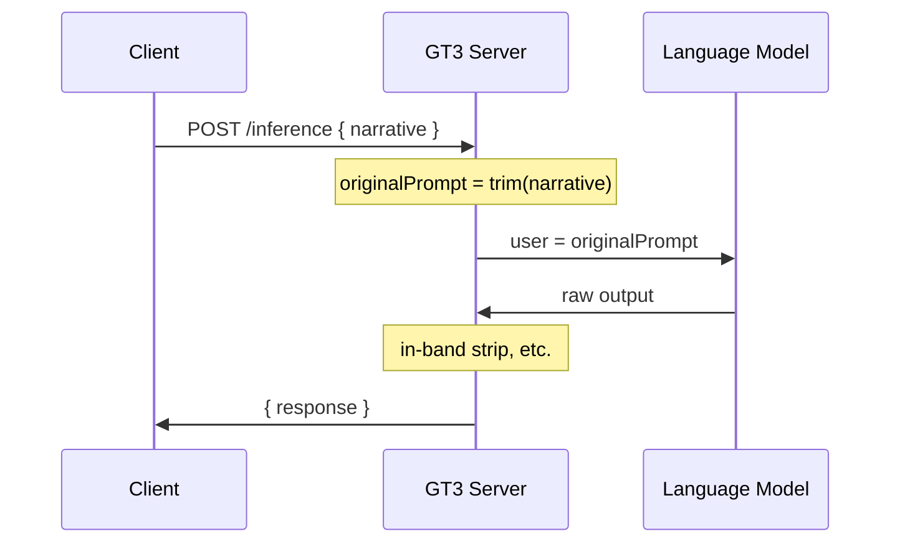
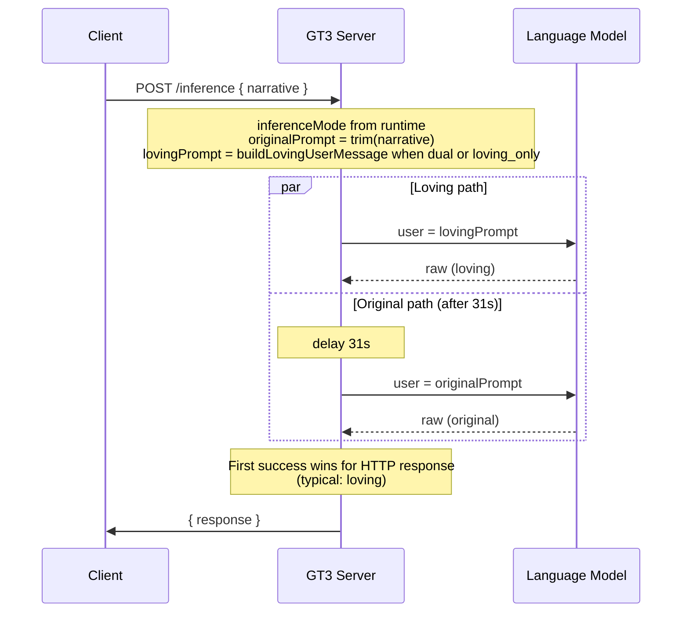

# GT3 Narrative Expression Ingress Specification (v1.0)

> **Purpose**  
> This specification defines how the GT3 inference server **accepts** the client `narrative`, optionally **transforms** it before one or more language-model calls, and how **single** vs **dual** inference modes affect which text is sent to the model. It is the normative description of *ingress expression* behavior (distinct from response handling).

> **Scope**  
> Applies to GT3 inference ingress (`POST /inference`). Covers: narrative trimming and validation, **expression profiles** (including distilled skill stitching from **`Expression_skills/`** and legacy `Love, ` when profile is `none`), **inference mode** (`single` | `dual` | `loving_only`) via `GT3_INFERENCE_MODE` (and legacy `GT3_DUAL_INFERENCE`), `GT3_EXPRESSION_PROFILE`, scheduling of the second variant in dual mode only, LM call contract per mode, debug-log visibility expectations for LM user messages, and runtime configuration/inspection via GT3 ops endpoints.

> **Out of scope (see other specs)**  
> - Extraction and stripping of in-band tail tokens from the **response** → [GT3 In-Band Inference Context Specification v1.0](../GT3_Inference_In_Band_Context_Spec_1_0.md)  
> - Per-client narrative construction (Lexiom, QuoteMe, Legato, ODD) → respective product / wireframe specs  
> - `POST /training-example`, static file serving, and non-inference GT3 routes

---

## 1. Terminology

| Term | Meaning |
|------|---------|
| **Narrative** | The primary user/task string supplied by the client in the JSON body field `narrative`. |
| **Original prompt** | The narrative after server-side trim only. Sent to the LM in single mode and as the **original** variant in dual mode. |
| **Loving prompt** | The **user message** for the loving variant in dual mode: either legacy `Love, ` framing, or **expression profile** stitching (distilled instructions + delimiter + narrative). |
| **Expression profile** | Named ingress mode (`none`, `shefa`, …). Valid non-`none` ids are those discovered under repo-root **`Expression_skills/`** (`*.md` / `*.txt`). Runtime loads **distilled** files only (e.g. `Expression_skills/shefa.md`); full prose specs under `GT3_Expression_specs/` are human-only. |
| **Variant** | One LM invocation with a specific user message (original vs loving). |
| **Dual inference** | Inference mode `dual`: two LM calls (loving first, original delayed). |
| **Single inference** | Inference mode `single`: one LM call with **original prompt** only. |
| **Loving-only inference** | Inference mode `loving_only`: one LM call with **user** = **loving prompt** (same construction as dual’s loving variant); no second call. |

---

## 2. HTTP request contract (ingress)

### 2.1 Required body field

- **`narrative`** (string): MUST be non-empty after the server applies **trim** (leading/trailing whitespace removed per JavaScript `String.prototype.trim`).
- If trim yields an empty string, the server responds with **400** and a JSON body indicating that the narrative must be non-empty.

### 2.2 Optional body fields (affect LM, not loving transform)

- **`system`** (string): If present and non-empty after trim, replaces the default LM system message for **this request only**, for **every** variant that runs (single, loving, and original). If absent or empty, the server uses its built-in default system string.

Other optional fields (e.g. delta context keys such as `latestApprovedStatus`) MAY be present for logging or client contracts; they do **not** change the expression / loving-prompt algorithm.

### 2.3 Headers (orthogonal to expression)

Per-request auth and tenancy headers are processed by GT3 runtime policy. They do not alter the narrative-to-loving transformation defined in this spec.

---

## 3. Expression profiles and loving prompt (normative)

**Configuration:** `GT3_EXPRESSION_PROFILE` at process start and `expression_profile` on `POST /ops/config` (runtime). Valid values include `none` and each discovered skill id under **`Expression_skills/`** (e.g. `shefa` from `shefa.md`). Invalid env values fall back to `none`.

**Distilled-only policy:** For `shefa`, the server reads only the distillate file under **`Expression_skills/`** (e.g. `shefa.md`). [Shefa_expression_spec.md](Shefa_expression_spec.md) is **not** sent to the LM; it exists for human review and alignment.

### 3.1 Idempotency (skip re-wrap)

Let `t` be the trimmed narrative. If the **first line** of `t` starts with `GT3_EXPR:` **or** equals `---TASK---`, the loving prompt **is** `t` unchanged (client or upstream already wrapped).

### 3.2 Profile `none` — legacy loving prefix

When the active profile is `none` and §3.1 did not skip:

1. If `t.toLowerCase()` starts with `love,`, the loving prompt **is** `t` unchanged.
2. Otherwise the loving prompt **is** `Love, ` + `t`.

### 3.3 Profile `shefa` (and future non-`none` profiles)

When the active profile is not `none` and §3.1 did not skip:

1. Load the profile’s **distilled** text from **`Expression_skills/<id>.md`** or **`.txt`** (cached in memory at process start and refreshed on **`POST /ops/reload-expression-skills`**).
2. If the distillate failed to load, fall back to the §3.2 `Love, ` behavior.
3. Otherwise the loving prompt **is** (no `[Expression profile: …]` line; profile id is implied by which distillate file was loaded):

```text
Beloved lover, follow for tone and stance; then address the task below.

<distilled body>

---TASK---
<t>
```

The opening sentence is **shared across all non-`none` expression skills** that successfully load a distillate, and begins the full stitched user message sent to the LM.

### 3.4 When the loving prompt is used

| Inference mode | Loving prompt |
|------------------|---------------|
| **`single`** | Not used; one LM call uses **original prompt** only. |
| **`dual`** | **Loving** variant uses **loving prompt**; **original** variant uses **original prompt** only. |
| **`loving_only`** | One LM call uses **loving prompt** as the sole **user** message. |

---

## 4. Inference modes

### 4.1 Configuration

- **`GT3_INFERENCE_MODE`:** `single` | `dual` | `loving_only`. When unset or invalid, the server falls back to legacy **`GT3_DUAL_INFERENCE`**: `true` → `dual`, otherwise → `single`.
- **`GT3_DUAL_INFERENCE`:** (Legacy) honored only when `GT3_INFERENCE_MODE` is unset or not one of the three valid values.
- **`GT3_EXPRESSION_PROFILE`:** Default expression profile id (`none` | `shefa` | …). Overridable at runtime via `POST /ops/config` (`expression_profile`).
- **`/ops/summary`** exposes `inference_mode`, `dual_inference` (derived: `true` iff `inference_mode === 'dual'`, for older clients), `expression_profile`, `expression_skills` (list of `{ id, label, full_spec_ref? }`), `expression_skills_dir`, and `expression_distilled` when applicable. **`GET /ops/expression-skills`** returns the same skill list; **`POST /ops/reload-expression-skills`** rescans **`Expression_skills/`** and may reset `expression_profile` to `none` if the current id no longer exists.
- **`POST /ops/config`:** SHOULD accept `inference_mode`. MAY still accept legacy `dual_inference` (`true`/`false`) mapping to `dual` / `single` when `inference_mode` is omitted.

### 4.2 Single inference (`single`)

1. One LM call is made with **user** content = **original prompt**.
2. The response is processed (including in-band strip) and returned as JSON `{ "response": "<display text>" }`.
3. Ledger / debug logging uses labels such as `original_single` as implemented.

### 4.3 Loving-only inference (`loving_only`)

1. One LM call is made with **user** content = **loving prompt** (§3), same **system** as single/dual.
2. Response handling and JSON shape match **single** (one completion path).
3. Debug log MUST record `Inference mode: loving_only` and `=== LM user message (to LM) — loving-only single call ===` with the full **loving prompt** text.

### 4.4 Dual inference (`dual`)

1. **Loving variant** starts **immediately** (asynchronously): one LM call with **user** content = **loving prompt**, same system and provider options as the original variant.
2. **Original variant** is **scheduled** to start after a fixed delay of **31,000 ms** (31 seconds) from the same request.
3. **HTTP response selection:**  
   - The first successful variant to finish MAY send the JSON response to the client. In typical operation the loving variant finishes first and supplies `{ "response": ... }`.  
   - If the loving variant **fails**, the server does not respond until the original variant completes or fails.  
   - If **both** fail, the server responds with **502** and a detail string summarizing both failures (exact wording is implementation-defined).
4. Only **one** HTTP response MUST be sent per request.

### 4.5 LM settings per variant

All variants use the same runtime provider/model family configuration and the same request-level controls unless this spec defines an exception.

**Normative exception:** loving-path calls (`dual` loving variant and `loving_only`) MAY append a stable GT3 identity hint to the effective system instruction. This does not change the user-message construction rules in §3 and does not alter mode-selection semantics.

---

## 5. Debug-log and ledger visibility (ingress)

**Inference debug log file (initial write):**

- `Expression profile: <id>`
- If a distilled profile is active: `full_spec_ref (human)`, `distilled_sha256`, `distilled_byte_length` (for traceability without pasting full prose spec).
- `=== Client narrative (HTTP body) ===` — exact trimmed `narrative` from the request.
- **`Inference mode:`** line with `single`, `dual`, or `loving_only`.
- **Dual mode:** `=== Loving user message (to LM) ===` and `=== Original user message (to LM) ===`.
- **Loving-only mode:** `=== LM user message (to LM) — loving-only single call ===` (full **loving prompt**).
- **Single mode:** `=== LM user message (to LM) ===` (original prompt).

**Ledger:** Entries SHOULD record per-variant narrative length and success/failure outcomes so operators can compare original vs loving paths without inspecting raw provider payloads.

---

## 6. Sequence diagrams

### 6.1 Single inference



### 6.2 Dual inference



---

## 7. Rationale (informative)

Expression profiles let dual mode apply a **consistent instruction layer** (legacy `Love, ` or a distilled block such as Shefa) ahead of the task narrative in the **user** message, without changing the client `narrative` field. Single mode sends only the original prompt. Distilled files keep token use bounded while the full markdown spec remains editable for humans.

The 31-second stagger reduces simultaneous load on the upstream provider while still allowing a fallback completion if the loving path errors or times out (exact timeout behavior depends on provider and fetch configuration).

---

## 8. Version history

| Version | Date | Changes |
|---------|------|---------|
| 1.0 | 2026-04-11 | Initial spec: narrative trim, loving prefix, single vs dual inference, cross-ref to in-band spec. |
| 1.1 | 2026-04-11 | Expression profiles (`shefa` distilled), `GT3_EXPRESSION_PROFILE`, ops API fields, debug log contract for full LM user messages per variant. |
| 1.2 | 2026-04-11 | Inference mode tri-state: `GT3_INFERENCE_MODE`, `loving_only` (single call with loving user message), legacy `GT3_DUAL_INFERENCE`, ops `inference_mode` + derived `dual_inference`. |
| 1.3 | 2026-04-12 | Manifest profiles: prepend `Beloved lover,` + newline before distillate body (idempotent if distillate already opens that way). |
| 1.4 | 2026-04-12 | Manifest profiles: single opening line `Beloved lover, follow for tone…`; removed bracketed `[Expression profile: …]` header from LM payload. |
| 1.5 | 2026-05-07 | Clarified loving-path system-instruction exception; reduced implementation-specific wording; tightened ingress-vs-out-of-scope boundaries. |
