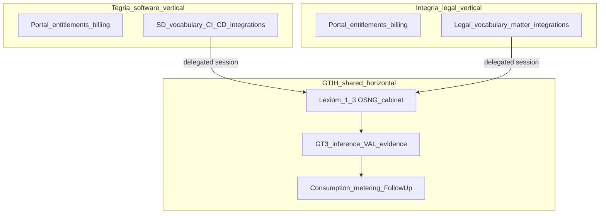

# GT3 ↔ GTIH Service Consumption — Technical Spec 1.2.1

**Status:** Technical design draft (maps commercial BD architecture onto this repository)  
**Audience:** GT3 / Lexiom engineers, vertical (Tegria- / Integria-class) integrators, IP-owner integrators  
**Commercial sources:** `[GT3_service_consumption.md](GT3_service_consumption.md)`; BD pitch *Two Vertical Paths Built Upon One Horizontal Intelligence Layer* (Tegria / Integria — §2a)  
**Related:** `[README.md](README.md)`, `[Lexiom_GT3_Data_Lakes_Spec_1_0.md](Lexiom_GT3_Data_Lakes_Spec_1_0.md)`, Lexiom 1.3 under `[public/gt2/Lexiom_1_3/](public/gt2/Lexiom_1_3/)`, planned Commercial Portal Identity / CPS work  

**Governance note:** This document translates commercial language into **implementation planes** in this repo. Where runtime behavior does not yet match the commercial architecture, items are marked **Known divergence**, **Assumption**, **Open question**, or **Follow-up required**. Do not treat Follow-up as shipped.

---

## 1. Purpose

Define how **GT Impact Holdings (GTIH)** horizontal services—described commercially in `[GT3_service_consumption.md](GT3_service_consumption.md)` and the Tegria/Integria commercialization pitch—map onto the **GT3 server** and **Lexiom 1.3** under `[public/gt2/Lexiom_1_3/](public/gt2/Lexiom_1_3/)`.

**Commercialization thesis (technical):** Multiple vertical startups consume the **same unmodified** Lexiom 1.3 + GT3 intelligence layer (OSNG gardens, outcome specs, thematic planes, inference, Success Evidences, lineage, controlled build/transform agents) through **metered APIs** and **(target) embeddable components**. Differentiation lives in vertical vocabulary, workflows, integrations, dashboards, and Business-Layer logic—not in forking the horizontal engine.

**GTIH product path in scope:** **Lexiom 1.3** only — OSNG observation/manipulation, LM inference, and build-agent execution. Other `./public` product trees are out of scope for this spec.

---

## 2. Role mapping (commercial → this repo)

| Commercial actor                   | Role in BD docs / pitch                                                                                                                       | Implementation plane in this project                                                                     |
| ---------------------------------- | --------------------------------------------------------------------------------------------------------------------------------------------- | -------------------------------------------------------------------------------------------------------- |
| **GTIH**                           | Horizontal GT3 + Lexiom runtime services; IP operations; service catalogue; metering/royalties                                                | **GT3** (`server.js`, `lib/`) + **generic Lexiom 1.3 cabinet engine** under `./public`                   |
| **Vertical — Tegria**              | Software-development workspace; owns SD vocabulary, CI/CD/repo integrations, engineering UX; invoices customers; owns customer OSNGs          | Vertical app + portal/CPS; **does not** modify GTIH OSNG/inference/VAL core                              |
| **Vertical — Integria**            | Legal collaboration / LegalTech; owns legal vocabulary, negotiation/approval UX, matter integrations; invoices customers; owns customer OSNGs | Same GTIH core; different shell and Business-Layer; **does not** fork Lexiom/GT3                         |
| **Customer tenant / user / agent** | Consumes vertical app under delegated credentials                                                                                             | Portal → Lexiom 1.3 with short-lived delegated token (**Follow-up** full hierarchy; POC: `cabinetToken`) |
| **IP owner**                       | Royalties from metered GTIH service use                                                                                                       | Expression skills, build plugins, Lexiom IP; royalty feeds **Follow-up**                                 |

**Constitutional alignment:** Vertical **navigates, brands, and differentiates**; Lexiom **cockpit governs** White→Black→Stability. GTIH/GT3 must not become the customer CRM or invoice system. **Neither vertical modifies the horizontal engine**—only invokes it.

---

## 2a. Commercialization scenario — two verticals, one horizontal layer

Engineering reading of the BD fictional pitch. Both startups lack year-one capacity to rebuild AI infrastructure, OSNG, agents, provenance, and usage governance; both consume GTIH via metered APIs and embeddable components.

### Common native layer (GTIH — do not fork)

| Pitch capability                          | Repo mapping                                                                 | Catalogue service (§4.1)                   |
| ----------------------------------------- | ---------------------------------------------------------------------------- | ------------------------------------------ |
| OSNG Graph Gardens; thematic perspectives | Lexiom 1.3 Side/Top (garden) views, PlaneShift / `standard_ancestor_osn_ids` | OSNG observe / manipulate                  |
| Intent → structured outcome specs         | OSN seed / lenses / `output_spec`; White Moves                               | OSNG manipulate + LM inference             |
| Candidate content generation              | Black Moves via `POST /inference`                                            | LM inference                               |
| Success Evidences + artifact lineage      | `success_evidences`, evidence tray, Bud / Center review                      | Evidence sync + build artifacts            |
| Shared inference & agentic layer          | GT3 inference; VAL prepare/run; WebContainer CA                              | Build prepare / agent execution            |
| Delegated sessions + signed consumption   | JWT hierarchy + `gtih_consumption_event.v1`                                  | Credential §3; metering §7 (**Follow-up**) |

**Invariant:** Tegria and Integria invoke the **same** headless routes and Lexiom 1.3 native semantics. Vertical code may wrap or re-label; it must not silently alter approval, provenance, or `graph.`* meaning.

### Tegria — software development as vertical domain

| Vertical presentation                                     | Native Lexiom / GT3 concept                  | Technical hook                                 |
| --------------------------------------------------------- | -------------------------------------------- | ---------------------------------------------- |
| Product intentions / feature requirements                 | OSN seed / `output_spec`                     | OSNG editors; narratives                       |
| Passing tests, screenshots, perf/security demos           | Success Evidences + collected artifacts      | Evidence kinds; `/lexiom13/evidence/*`; Bud    |
| Feature branch → implementation instructions              | Compilation root + document/software plugins | `POST /lexiom13/build/prepare`                 |
| Spawn build agent, run tests, show product-review cockpit | VAL + preview/Bud                            | `POST /lexiom13/build/run`; builds host        |
| Repos, issues, CI/CD, coding agents, IDEs                 | **Business-Layer only** (Tegria)             | Outside GTIH core; call GTIH after entitlement |

Tegria’s value is **SD vocabulary, workflows, integrations, dashboards**—not a private copy of Lexiom/GT3.

### Integria — legal development as vertical domain

| Vertical presentation                                             | Native Lexiom / GT3 concept                              | Technical hook                                      |
| ----------------------------------------------------------------- | -------------------------------------------------------- | --------------------------------------------------- |
| Matters, contractual objectives, positions, clauses, risks        | OSN nodes / seeds / output specs                         | Same OSNG APIs; Integria i18n/labels                |
| Commercial / regulatory / tax / privacy / enforceability concerns | Thematic planes / discipline lenses / standard ancestors | PlaneShift; multi-plane UX                          |
| Partner approval, schedules, consistency, jurisdictional review   | Success Evidences                                        | Evidence definitions + tray (kinds labeled legally) |
| Reconcile narratives, draft clauses, contradictions               | GT3 Black Move inference                                 | `POST /inference`                                   |
| Why a clause exists / which concern shaped it                     | Lineage / causal evidence / provenance spine intent      | Lineage UX + evidence; Spine depth **Partial**      |
| Clause compare, negotiation, signature, matter systems            | **Business-Layer only** (Integria)                       | Outside GTIH core                                   |

**Assumption:** Both Tegria and Integria present the **same Lexiom 1.3** OSNG cockpit; differentiation is vertical shell, vocabulary, and Business-Layer integrations only.

### Expedited time-to-demoable value

| Vertical demo (pitch)                                     | Depends on GTIH services already in §4.1      |
| --------------------------------------------------------- | --------------------------------------------- |
| Tegria: intention → tested software evidence              | OSNG + inference + prepare/run + evidence/Bud |
| Integria: competing narratives → approved traceable draft | OSNG + planes + inference + evidences         |

Vertical energy goes to **market differentiation**; GTIH supplies intelligence, traceability, and operational credibility.

---

## 3. Trust and credential model

### 3.1 Commercial requirement

Delegated, session-scoped credentials carrying a **hierarchical pseudonymous identity**:

1. Vertical entity (e.g. Tegria vs Integria)
2. Customer tenant
3. Consuming application / environment
4. Individual user or automated agent

Plus a **shared session identifier** across OSNG ops, inference, and build-agent execution. GTIH receives consumption metadata—not customer legal names, prices, or vertical revenue.

### 3.2 Mapped implementation

| Claim / concept           | Target field / mechanism                                | Status                                                                                                    |
| ------------------------- | ------------------------------------------------------- | --------------------------------------------------------------------------------------------------------- |
| Vertical entity           | `vertical_id` / issuer-bound `iss`                      | **Follow-up** (POC may use `iss: cps-local`; must distinguish Tegria vs Integria in multi-vertical demos) |
| Customer tenant           | `tenant_id` (+ display `tenant_name` for UI only)       | Planned POC JWT / `X-GT3-Tenant`                                                                          |
| Application / environment | `product` e.g. `lexiom_1_3`, optional `env`             | Planned POC                                                                                               |
| User / agent              | `sub` (player_id or agent_id)                           | Planned POC                                                                                               |
| Shared session            | `jti` and/or `game_record_id` / Lexiom 1.3 play session | Partial: game records + agent `runId`; unified hierarchy **Follow-up**                                    |
| Delegated credential      | Short-lived JWT (`cabinetToken` query → Bearer)         | Planned (align SaaS brief + CPS); **Known divergence:** demo often uses local/demo tenant headers         |

**Assumption:** Pseudonymous IDs are stable for the session; cross-session user profiles remain a vertical concern unless commercial terms say otherwise.

---

## 4. GTIH service catalogue ↔ Lexiom 1.3 / GT3 mapping

Each row is a **GTIH service** (commercial catalogue entry). **Delivery** is either **headless API** (GT3 HTTP) and/or the **Lexiom 1.3** product UI under `[public/gt2/Lexiom_1_3/](public/gt2/Lexiom_1_3/)`. Both Tegria and Integria consume this **same** catalogue; only shells differ (§2a).

### 4.1 Lexiom 1.3 services

| GTIH service (commercial)                 | Headless GT3 surface                                                                                 | Lexiom 1.3 product surface                                                                            | Billable unit (target)           | Status                                                                                                                 |
| ----------------------------------------- | ---------------------------------------------------------------------------------------------------- | ----------------------------------------------------------------------------------------------------- | -------------------------------- | ---------------------------------------------------------------------------------------------------------------------- |
| **OSNG observe (list/read)**              | `GET /lexiom13/osn/list`; static/read of seated `*.osn.yaml`                                         | Left panel, Side/Top full-graph                                                                       | list/read ops or session-minutes | **Implemented** (today rooted under GT3 `public/gt2/Lexiom_1_3/`**); **CPS-seated OSNG** for portal sessions = planned |
| **OSNG manipulate (save/canonize)**       | `POST /lexiom13/osn/save`, `POST /lexiom13/osn/canonize`                                             | Center Playfield White Moves / OSN editors                                                            | mutation ops                     | **Implemented** on GT3 disk seat; portal seat **Follow-up/POC**                                                        |
| **LM inference (Black Move)**             | `POST /inference`                                                                                    | Black Moves via client narratives                                                                     | tokens / calls                   | **Implemented**                                                                                                        |
| **Build prepare**                         | `POST /lexiom13/build/prepare`                                                                       | Build glyph / prepare flow                                                                            | prepare events                   | **Implemented**                                                                                                        |
| **Build agent execution (VAL)**           | `POST /lexiom13/build/run`, session workspace/file/tools, `POST /v1/chat/completions` (agent broker) | WebContainer CA (`[ca/](public/gt2/Lexiom_1_3/ca/)`); build artifacts on `:8081` `/lexiom13/<runId>/` | agent turns / tool calls / run   | **Implemented** (`browser_session` + `bolt_webcontainer`)                                                              |
| **Build status / preview / artifacts**    | `GET /lexiom13/build/status/:runId`, preview & artifact routes                                       | Bud / Center review, builds host                                                                      | artifact fetch                   | **Implemented**                                                                                                        |
| **Evidence collection sync**              | `GET /lexiom13/evidence/collections`, artifact GETs                                                  | Right Panel evidence tray                                                                             | poll/fetch                       | **Implemented**                                                                                                        |
| **Session telemetry**                     | `POST /lexiom-session/event`, `GET /game-records`, essence                                           | Vertical dashboards (read); Lexiom 1.3 selective emit                                                 | events                           | **Partial**                                                                                                            |
| **Embeddable brand-configurable UI**      | N/A (GTIH-operated components)                                                                       | Full-page Lexiom 1.3 cabinet today—not a packaged embed SDK                                           | component-session                | **Known divergence:** SPA under `/gt2/Lexiom_1_3/`; versioned embeddable widgets **Follow-up**                         |
| **Headless neutral structured responses** | JSON from `/inference`, `/lexiom13/`*, evidence APIs                                                 | Vertical may re-skin; Lexiom 1.3 also consumes directly                                               | per API                          | **Partial** (product-shaped payloads; formal “neutral DTO” layer **Follow-up**)                                        |

### 4.2 GTIH platform services supporting Lexiom 1.3 (not vertical product UI)

| Service                                | Surface                                        | Notes                                    |
| -------------------------------------- | ---------------------------------------------- | ---------------------------------------- |
| Inference ledger                       | `GET /inferences`, `ledger.jsonl`              | Traceability; metering precursor         |
| Ops summary / agent exchange inspector | `/ops/*`                                       | GTIH ops for Lexiom 1.3 agent traffic    |
| Expression skills                      | `Expression_skills/`, `/ops/expression-skills` | IP-adjacent prompt capital for inference |
| Health                                 | `GET /healthz`                                 | Infra                                    |

---

## 5. OSNG ownership vs GTIH processing (critical boundary)

| Concern                                  | Commercial rule                                                          | Technical mapping                                                                                                                                                                                |
| ---------------------------------------- | ------------------------------------------------------------------------ | ------------------------------------------------------------------------------------------------------------------------------------------------------------------------------------------------ |
| **Authoritative owner of customer OSNG** | Vertical (Tegria / Integria) / customer data controller                  | Portal/CPS OSNG seat for portal-opened sessions (**planned**); GT3 must not claim commercial ownership of customer graphs                                                                        |
| **Unmodified horizontal engine**         | Verticals must not rebuild or fork OSNG/inference/agent/provenance cores | Single Lexiom 1.3 + GT3 implementation; verticals consume via credentials + UI shell                                                                                                             |
| **GTIH processing**                      | Transient or retained per commercial terms                               | Today Lexiom 1.3 reads/writes `public/gt2/Lexiom_1_3/**/*.osn.yaml` on the GT3 host — **Known divergence** vs “vertical owns seat”; CPS copy+seat is the POC correction path                     |
| **Business-Layer artifacts**             | Vertical-owned                                                           | Builds under `builds/lexiom13/<runId>/` are GTIH-operated workspaces; commercial ownership of deliverables is contractual — retain operation IDs in vertical records (**Follow-up** linking API) |
| **OSN ownership (player owns node)**     | Commerce/identity metadata                                               | Not encoded as sole source in OSN YAML for POC; portal `/v1/.../osn-ownership` (**planned**) drives highlight/filter only                                                                        |

Lexiom 1.3 **must not** treat GTIH metering or ownership rows as `graph.`* topology.

---

## 6. Headless APIs vs embeddable UI (Lexiom 1.3)

### 6.1 Headless (GTIH-operated)

Vertical backends or browsers with delegated credentials invoke GT3 routes in §4.1. Responses should remain **operationally authoritative** (ids, run status, evidence manifests). Vertical may rename labels in its chrome without altering ids or approval semantics.

### 6.2 Product UI (current)

`[public/gt2/Lexiom_1_3/](public/gt2/Lexiom_1_3/)` is the **GTIH-operated Lexiom 1.3 cabinet** (HTML/JS/CSS + OSN discovery UX). It is served from GT3’s static root today (`http://localhost:8080/gt2/Lexiom_1_3/`).

Pitch expects verticals to present this native layer under **their** terminology and branding. Today that is primarily **full-page GTIH SPA** plus vertical chrome around it—not a finished embed SDK.

**Follow-up — embeddable components:** extract versioned, style-tokenized fragments (e.g. graph garden, draft card, Bud preview, evidence tray) with a published integration contract so Tegria/Integria host shell branding while GTIH operates the component origin.

### 6.3 Hybrid long-term (design intent)

Industry pattern: **white-label multi-tenant SaaS** (also called **embedded SaaS**): a horizontal provider operates the shared engine; B2B consumers brand and wrap it for their markets.

**Abstract industry references** (non-normative; illustrate the consumption pattern only—not product requirements or partnerships):

| Reference | Horizontal capability (analogue) | B2B consumer role (analogue) |
|-----------|----------------------------------|------------------------------|
| **Stripe** | Payments / Connect APIs | Platforms embed checkout under their brand |
| **Twilio** | Communications APIs (SMS, voice, video) | Apps embed messaging/calls inside their own UX |
| **Auth0 (Okta)** | Identity / authentication platform | SaaS products white-label login and session |

GTIH : Lexiom 1.3 / GT3 :: Stripe/Twilio/Auth0 : horizontal runtime; Tegria/Integria :: the B2B vertical that owns customer experience and Business-Layer logic.

| Owned by GTIH / GT3 (shared; unmodified by verticals)                                                  | Owned by each vertical / CPS                                                       |
| ------------------------------------------------------------------------------------------------------ | ---------------------------------------------------------------------------------- |
| OSNG engine, gardens/planes, White/Black loop, VAL, inference, evidence collection, lineage primitives | Login, entitlements, billing, customer OSNG seat, OSN ownership registry           |
| Headless `/inference`, `/lexiom13/*`                                                                   | Domain vocabulary, workflows, dashboards, repo/CI or matter/signature integrations |
| Metering + royalty allocation (**Follow-up**)                                                          | Display of GTIH-signed usage only (no local royalty authority)                     |

**POC CPS-as-BFF** (portal origin proxies SPA + APIs) is a **Known divergence** from this hybrid ideal; acceptable for demo if documented as temporary.

---

## 7. Consumption events, tariffs, royalties

### 7.1 Commercial requirement

Every successful billable operation → **GTIH-signed consumption event** (service, session, pseudonymous identity, measurement, tariff, IP assets, royalty allocation). Atomic with service success where feasible. Vertical owners and IP owners get read-only feeds; verticals do **not** compute authoritative royalties. Real-time charge + royalty allocation is what lets GTIH commercialise patented Lexiom/GT3 capabilities across Tegria and Integria without sharing customer PII.

### 7.2 Current implementation (precursors only)

| Artifact                             | Role today                  | Gap vs BD                                        |
| ------------------------------------ | --------------------------- | ------------------------------------------------ |
| Inference ledger / `GET /inferences` | Call traceability           | Not signed consumption events; no tariff/royalty |
| Agent broker / Ops agent exchanges   | Agent LM traffic visibility | Not royalty allocation                           |
| `POST /lexiom-session/event`         | Gameplay/session essence    | Not commercial metering                          |
| `X-GT3-Tenant`                       | Weak tenancy tag            | Not hierarchical pseudonymous credential         |

### 7.3 Target metering shape (**Follow-up**)

Emit `gtih_consumption_event.v1` on success of catalogue services in §4.1, including at minimum:

- `event_id`, `signed_at`, `signature`  
- `service_id`, `service_version`, `tariff_version`  
- `session_id`, `vertical_id`, `tenant_pseudonym`, `env`, `actor_pseudonym`  
- `measurement` (e.g. tokens, tool_calls, osn_mutations)  
- `ip_asset_ids[]` (from IP registry — §8)  
- `royalty_allocations[]`

**Placement:** Prefer GT3 edge after authz + successful handler (**Open:** exact hop when CPS BFF is in path—meter on GTIH origin of truth, not on vertical proxy alone).

**Catalogue / tariffs / allocation rules:** GTIH-maintained versioned store (**Follow-up**; not in repo today).

---

## 8. IP owner plane

| BD requirement               | Repo mapping                                                                                                       | Status                                          |
| ---------------------------- | ------------------------------------------------------------------------------------------------------------------ | ----------------------------------------------- |
| Machine-readable IP registry | Candidates: Expression skills, build-plugin packages, Lexiom 1.3 specs/code under `public/gt2/Lexiom_1_3/`, `lib/` | Informal; **Follow-up** stable `ip_id` registry |
| Signed release manifests     | Not implemented                                                                                                    | **Follow-up**                                   |
| Map IP → GTIH services       | e.g. VAL plugin → `build.agent.run`; inference profiles → `inference.black_move`                                   | **Follow-up**                                   |
| Read-only royalty/usage feed | None                                                                                                               | **Follow-up**                                   |

IP owners must not receive customer identities or OSNG business content unless separately authorized.

---

## 9. Vertical integrator checklist (Tegria- / Integria-class)

Aligned with commercial Appendix A and the dual-vertical pitch:

1. **Authenticate customers** and hold entitlements on the vertical/CPS plane.
2. **Mint short-lived delegated JWT** for Lexiom 1.3 open (`cabinetToken`) with hierarchy in §3 (`vertical_id` distinguishes Tegria vs Integria).
3. **Retain authoritative customer OSNG** (vertical/CPS seat); keep GTIH operation/run ids on local records.
4. Invoke **unmodified** Lexiom 1.3 + GT3 services (§4.1); do not fork `public/gt2/Lexiom_1_3` into a private engine.
5. Own **domain shell only:** Tegria → SD language + engineering integrations; Integria → legal language + matter/negotiation integrations.
6. Re-label UX without changing OSN ids, evidence ids, run ids, or White-Move approval semantics.
7. **Do not** recompute royalties—display GTIH-signed usage when available.

---

## 10. GTIH / GT3 implementer checklist

Aligned with commercial Appendix B:

1. Expose versioned Lexiom 1.3 + inference + build services (§4.1) as one catalogue for all verticals.
2. Validate delegated credential, session, scope, entitlement before execution (**Follow-up** enforcement).
3. Implement signed consumption events atomic with success (**Follow-up**).
4. Separate **operational content** (OSNG bytes, build trees) from **metering metadata**.
5. Keep Ops console and raw ledgers off customer paths.
6. Version APIs and catalogue entries for backward compatibility.

---

## 11. Lexiom 1.3 entry points (operator quick reference)

| Kind                  | URL / route                                                     |
| --------------------- | --------------------------------------------------------------- |
| Cabinet SPA           | `GET /gt2/Lexiom_1_3/` (COOP/COEP)                              |
| OSN list              | `GET /lexiom13/osn/list`                                        |
| OSN save / canonize   | `POST /lexiom13/osn/save`, `POST /lexiom13/osn/canonize`        |
| Inference             | `POST /inference`                                               |
| Build prepare / run   | `POST /lexiom13/build/prepare`, `POST /lexiom13/build/run`      |
| Agent broker          | `POST /v1/chat/completions`                                     |
| Evidence              | `GET /lexiom13/evidence/collections?osn_id=`                    |
| Build SPA / artifacts | `http://localhost:8081/lexiom13/<runId>/` (default builds port) |

Canonical product behavior: `[Lexiom_1.3.3_System_Description.md](public/gt2/Lexiom_1_3/Lexiom_1.3.3_System_Description.md)`, BuildPlugins under `[public/gt2/Lexiom_1_3/BuildPlugins/](public/gt2/Lexiom_1_3/BuildPlugins/)`.

---

## 12. Known divergences and Follow-ups (summary)

| Item                                                                                        | Classification                                                                      |
| ------------------------------------------------------------------------------------------- | ----------------------------------------------------------------------------------- |
| No signed consumption / tariff / royalty pipeline                                           | **Follow-up required**                                                              |
| No full hierarchical delegated credential enforcement on all `/lexiom13/*` and `/inference` | **Follow-up required** / **Known divergence** (demo tenant headers)                 |
| Customer OSNG authoritative seat still often GT3 `public/`                                  | **Known divergence**; CPS seat planned for portal POC                               |
| Embeddable brand-configurable component SDK                                                 | **Follow-up required** (full-page SPA today)                                        |
| Neutral headless DTO layer separate from Lexiom SPA shapes                                  | **Follow-up**                                                                       |
| IP registry + signed manifests + royalty feeds                                              | **Follow-up required**                                                              |
| CPS BFF serving SPA as single browser origin                                                | **Assumption** for POC; hybrid target = GT3 serves generic UI, CPS serves commerce  |
| Pitch “embeddable components” + real-time signed metering for both verticals                | **Follow-up required** (see §6.2, §7)                                               |
| Dual vertical demos without forking Lexiom 1.3                                              | **Supported by design** (§2a); needs credential `vertical_id` + separate OSNG seats |
| Lexiom 1.4 `/lexiom14` embedded-SaaS path (session replica, document Realization, POC metering) | **Implemented (Phase b POC)** under `public/gt2/Lexiom_1_4/` + `lib/lexiom14*`; see §14 |

---

## 13. Document control

- **Version:** 1.2.2  
- **Supersedes:** 1.2.1 (adds Lexiom 1.4 path note §14)  
- **Companion commercial:** `[GT3_service_consumption.md](GT3_service_consumption.md)`  
- **Update rule:** when adding a billable GT3 / Lexiom 1.3 route, add a catalogue row here and mark metering status; when BD adds a vertical scenario, extend §2a without forking the §4.1 catalogue.  
- **Authority:** commercial BD docs govern *business intent*; this spec governs *repo mapping* for **Lexiom 1.3 + GT3**, with **Lexiom 1.4** as the vertical embedded-SaaS path (§14). On conflict of intent vs code, prefer explicit Known divergence over silent drift.  
- **Scope:** Lexiom 1.3 (`[public/gt2/Lexiom_1_3/](public/gt2/Lexiom_1_3/)`) and supporting GT3 APIs; Lexiom 1.4 (`[public/gt2/Lexiom_1_4/](public/gt2/Lexiom_1_4/)`) for vertical SDK consumption.

---

## 14. Lexiom 1.4 path (embedded SaaS)

**Intent:** Verticals (TRH, Tegria-class) consume GTIH capabilities via versioned `/lexiom14` APIs and a TypeScript/JS SDK without becoming a Lexiom 1.3 cockpit fork and without editing `Lexiom_1_3/`.

| Concern | Mapping |
| --- | --- |
| Contracts | `[public/gt2/Lexiom_1_4/contracts/](public/gt2/Lexiom_1_4/contracts/)` (`lexiom14/1.0`) |
| GT3 routes | `lib/lexiom14*.js` mounted at `/lexiom14` |
| Session OSNG replica | In-memory session store (POC); vertical remains SoR; `generateOsn` writes a single YAML OSN onto the replica |
| Document Realization | Server-side `document.md` + TEXTUAL_SNIPPET package (POC); browser WebContainer CA on TRH origin is Follow-up |
| Draft formation | `POST /lexiom14/v1/sessions/:id/osn` — Lexiom owns output spec / direct Success Evidences; TRH sends one outcome description |
| Metering | Append-only `logs/lexiom14_consumption.jsonl` (`gtih_consumption_event.v1` shape; unsigned POC) |
| CORS | `GT3_LEXIOM14_CORS_ORIGINS` (defaults include TRH `:4173` and smoke `:8080`) |
| Smoke host | `/gt2/Lexiom_1_4/host/` |

**Known divergence vs Lexiom 1.3-only thesis in §1–§4:** commercial catalogue rows remain Lexiom 1.3-centric; Lexiom 1.4 is an additional consumption path. Full tariff/royalty signing, CPS mint, and software Realization profile remain Follow-up.

