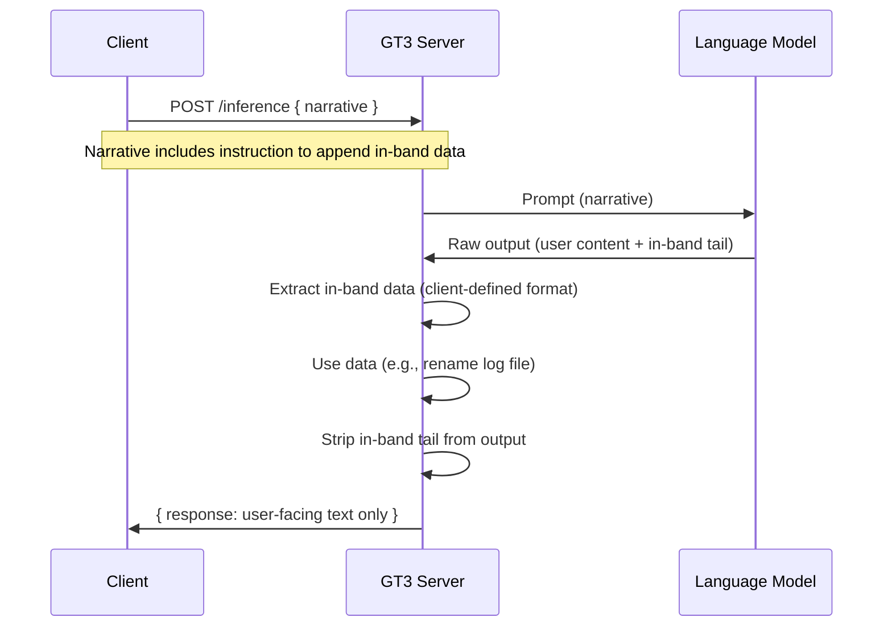

# GT3 In-Band Inference Context Specification (v1.0)

> **Purpose**
> This specification defines the **generic in-band communication mechanism** between GT3 clients and the GT3 inference server. The client instructs the LM to embed structured data at the tail of its output; the server extracts this data for its own needs (e.g., log file naming) and removes it from the response before returning it to the client.

> **Scope**
> Applies to all GT3 clients that wish to pass contextual data to the server through the inference pipeline without extending the API contract. The mechanism uses the LM's output stream as the carrier; no out-of-band headers or separate endpoints are required.

> **Relationship to client-specific specs**
> The format, syntax, and semantic rules of the in-band payload are **client-defined**. Client applications (e.g., Lexiom) publish peripheral specifications that extend this mechanism with their own payload formats. See [Lexiom In-Band Description Spec](public/gt2/Lexiom/Lexiom_Peripheral_Specs/Lexiom_In_Band_Description_Spec_1_0.md) for Lexiom's implementation.

> **Non-goals (v1.0)**
> - General-purpose metadata passing (arbitrary JSON, key-value pairs).
> - Bidirectional in-band data (server-to-client metadata in the same channel).
> - Versioned negotiation of in-band payload formats.

---

## 1. Overview

### 1.1 In-Band vs Out-of-Band

- **Out-of-band**: Data passed via HTTP headers, request body fields, or separate API calls. The client and server exchange metadata explicitly in the protocol layer.
- **In-band**: Data embedded inside the primary payload (the LM narrative/response). The LM is instructed to produce output that includes both user-facing content and machine-readable data; the server parses the output to separate the two.

### 1.2 Rationale

In-band communication allows the server to obtain context that depends on the **actual LM response** without:
- Extending the API (new request/response fields)
- Requiring the client to parse or interpret LM output
- Adding round-trips or callbacks

The canonical use case: **inference log file naming**. The server wants log files named by a phrase that describes the inference output. That phrase is only known after the LM responds. The client instructs the LM to append the phrase; the server extracts it, renames the log file, strips it from the response, and returns only the user-facing text to the client.

---

## 2. Protocol Flow

### 2.1 Client Responsibilities

1. **Append the in-band instruction** to the narrative before sending it to GT3. The instruction tells the LM to end its response with a specific format defined by the client's peripheral spec.
2. **Do not parse or handle** the in-band data. The client receives only the stripped response.
3. **Preserve instruction ordering** when concatenating narrative segments (e.g., task, language directive, in-band instruction).

### 2.2 Server Responsibilities

1. **Pass the full narrative** (including the in-band instruction) to the LM.
2. **Extract** the in-band data from the raw LM output using the format rules agreed with the client (see client peripheral specs).
3. **Use** the extracted data for server-defined purposes (e.g., log file renaming).
4. **Strip** the in-band tail from the output before returning it to the client.
5. **Gracefully handle** missing or malformed in-band data (no extraction, no rename; return raw output as-is or with best-effort strip).

---

## 3. Generic In-Band Payload Model

### 3.1 Deterministic Extraction Rule

The server uses a **position-based primary rule** for extraction and stripping:

- **Phrase**: The last continuous non-whitespace string in the response — i.e., the sequence of characters located beyond the last blank space (or newline/tab) in the narrative.
- **Signaling mark**: In-band tokens must begin with an underscore (`_`), e.g. `_L23_Clarify_`, `_L24_Draft_`. The underscore at the start of the last token signals the presence of an in-band phrase to extract and strip.
- **Strip**: The server removes that last token and the whitespace before it only when the last token begins with `_`.

This primary rule is independent of phrase length or internal structure and is the normative contract clients should target.

### 3.1.1 Robustness tolerance (server-side)

Implementations MAY apply conservative recovery when the final phrase is nearly valid but malformed by minor LM formatting drift (for example accidental whitespace/punctuation inside the terminal phrase), provided that:

- extraction still anchors to the tail of the response,
- stripping never removes non-tail user-facing content,
- and the returned display text remains the intended user content without in-band leakage.

### 3.2 Client-Defined Format

Clients define the phrase structure (e.g. 6-word format per Lexiom spec). The phrase must:
- Be preceded by whitespace (space, newline, or tab) so it forms the "last token"
- Begin with an underscore (`_`) as the in-band signaling mark (e.g. `_L23_Clarify_foo_bar_baz`)
- Have no internal spaces (use underscores for multi-word structure)

### 3.3 Client Instruction (Generic)

The client appends an instruction block to the narrative. The instruction must direct the LM to:
- End the response with whitespace (e.g. a newline) followed by the in-band phrase.
- Use the format and semantic rules defined in the client's peripheral spec.
- Ensure no other text follows the phrase.

---

## 4. Server Uses

### 4.1 Inference Log File Naming

**Purpose:** Rename the inference debug log artifact from a default machine-generated name to a phrase-prefixed name for human-readable admin browsing.

**Behavior:**
- Initial log artifact uses a default machine-generated name.
- If extraction succeeds and the phrase passes validation, rename to: `<sanitized_phrase>.<request-id>.txt` (or equivalent runtime identifier shape).
- **Blocklist:** Certain phrases (e.g., instruction examples the LM may copy) may be excluded from renaming. Those files retain the default name.

**Validation before rename:**
- Phrase length ≤ 120 (or client-defined limit)
- Phrase is sanitized for filesystems: any character not in `[a-zA-Z0-9_-]` is replaced with `_`; trailing underscores are trimmed. The sanitized base must be non-empty and start with `_`.
- Phrase not in server blocklist (if applicable)

The server accepts phrases with minor LM deviations (e.g. a trailing period) by sanitizing before validation; only the sanitized form is used for the filename.

### 4.2 Future Uses (Reserved)

The specification does not preclude additional server uses of the extracted phrase (e.g., ledger indexing, analytics tags). Such uses should remain consistent with the extraction and stripping contract so the client experience is unchanged.

---

## 5. Failure Modes

| Condition | Server Behavior |
|-----------|-----------------|
| No last token (no preceding whitespace) | No strip; return raw output |
| Last token does not begin with `_` | No strip under primary rule; implementation MAY attempt safe recovery per §3.1.1 |
| Last token begins with `_` | Strip phrase; use for rename if valid |
| Phrase too long (>120 chars) | Strip; no rename |
| Phrase in blocklist | Strip; no rename |
| Phrase invalid chars for filename | Sanitize; rename if valid after sanitization |

---

## 6. Cross-Reference

| Client | Peripheral Spec | Payload Name | Word Count |
|--------|-----------------|--------------|------------|
| Lexiom | [Lexiom_In_Band_Description_Spec_1_0](public/gt2/Lexiom/Lexiom_Peripheral_Specs/Lexiom_In_Band_Description_Spec_1_0.md) | in_band_description_of_Lexioms_act | 6 |

---

## 7. Version History

| Version | Date | Changes |
|---------|------|---------|
| 1.0 | (draft) | Initial generic in-band mechanism; split from Lexiom-specific spec |
| 1.1 | (draft) | §4.1: Validation updated to describe sanitize-first flow; server tolerates LM deviations (e.g. trailing punctuation) |
| 1.2 | 2026-05-07 | Clarified primary deterministic rule plus optional safe recovery tolerance; reduced filename-shape implementation coupling. |
