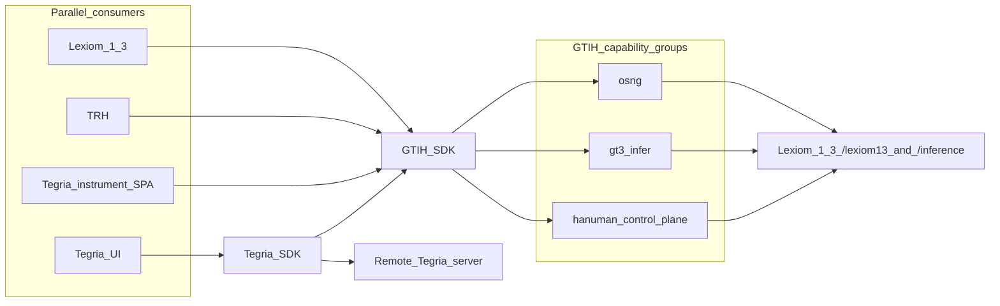

# GTIH API — human overview (`gtih/0.1`)

Short map of the HTTP garden the **GTIH SDK** wraps. Lexiom offers this SDK; vertical UIs consume it.

**Substrate:** today’s Lexiom 1.3 GT3 routes. **No new backend** for v0.1.

**Parallel tracks:** GTIH SDK + Lexiom migration, Tegria instrument SPA / Tegria SDK (with remote domain–tenant data), and TRH integration proceed **in parallel**—not a deferred “Tegria later” phase. They share GTIH; they do not wait on each other.

| Consumer | How it uses GTIH |
|----------|------------------|
| Lexiom 1.3 | Migrates cockpit transport onto GTIH SDK |
| Tegria instrument SPA | Calls GTIH **directly** (transport proof), built **in parallel** with Lexiom migration |
| Tegria UI / Tegria SDK | **Parallel** vertical track: wrapper over GTIH **plus** domain-related and/or **tenant-bounded** data saved and served from a **remote Tegria server**, for the user/player’s benefit. That enrichment **increments the economic value** of the unified SDK for Tegria’s domain consumers |
| The Reasoning Hub (TRH) | Calls **GTIH SDK directly** (no Tegria tenant plane), also **in parallel** |

Normative machine contract: [`openapi.yaml`](./openapi.yaml). Rationale: [`OPENAPI_PROPOSITION.md`](./OPENAPI_PROPOSITION.md).

---

## Diagram (for review)

Three GTIH capability groups (detail below): **OSNG**, **GT3 inference**, **Hanuman** (realization control plane).

---

## How to read this

| You are… | You call… |
|----------|-----------|
| Lexiom / TRH / Tegria instrument SPA | `window.gtih.*` (GTIH SDK) — not raw `fetch` paths |
| Tegria UI | `tegria.*` wrapper (GTIH + Tegria remote domain/tenant store) **or** `gtih.*` alone when vertical data is not needed |
| GTIH SDK | the HTTP paths below, unchanged |
| Tegria SDK | GTIH operations **and** Tegria-server APIs (tenant/domain) — out of scope for this GTIH doc; developed **in parallel** |

---

## 1. OSNG — the garden of intention

| Intent | GTIH SDK | HTTP |
|--------|----------|------|
| List live OSN files | `gtih.osng.list()` | `GET /lexiom13/osn/list` → `{ paths: string[] }` |
| Load one node | `gtih.osng.getYaml(path)` | `GET` public path → YAML text |
| Propose OSNG from SUD intent (start) | `gtih.osng.proposeFromIntent({ intent, max_descendants? })` | `POST /lexiom13/osn/propose` → `{ status: "awaiting_browser", run_id, ca_session, meta }` |
| Propose status | `gtih.osng.getProposeStatus(run_id)` | `GET /lexiom13/osn/propose/status/:runId` → `awaiting_browser \| running \| ok \| failed` + envelope on ok |
| Propose labor (browser) | `gtih.hanuman.serveProposeSession(ca_session)` | Lexiom CA WebContainer (`OSNG_PROPOSAL.json`) |
| Propose until done | `gtih.osng.proposeFromIntentUntilDone(...)` | start → labor → poll |
| Propose then realize (TRH) | `gtih.osng.proposeThenRealizeUntilDone(..., { onEnvelope? })` | propose → ephemeral prepare → realize → evidence + SUD; `onEnvelope` fires when the draft OSNG is ready (before prepare/realize) |
| Canonize (create) | `gtih.osng.create({ osn, parentOsnId })` | `POST /lexiom13/osn/save` `operation: "create"` |
| Persist edits | `gtih.osng.update({ osn, previousFileName? })` | same, `operation: "update"` |
| Prune branch | `gtih.osng.delete({ rootOsnId, confirmRootPrune? })` | same, `operation: "prune"` |

**Day-zero propose:** `max_descendants: 0` means a **single-OSN OSNG** (root only). Higher caps are accepted but clamped until multi-node arithmetic lands. Draft only — no Lexiom YAML write. SDK verb stays on `osng.*`; labor is **browser Hanuman** (`meta.labor: hanuman_browser_ca`), not product `/inference`.

**Errors:** On start/status/labor/parse failure the API returns `{ detail, debug }` (no silent deterministic draft). SDK errors expose `err.detail`, `err.debug`, and `err.body`.

**Relationships** and **content** live inside the OSN object on create/update — no separate relationship URL.

Errors usually look like `{ "detail": "…" }` with 4xx/5xx.

---

## 2. GT3 — direct inference

| Intent | GTIH SDK | HTTP |
|--------|----------|------|
| Infer | `gtih.gt3.infer(narrative, { inferenceType? })` | `POST /inference` `{ narrative }` → `{ response }` |
| API key (optional) | `getApiKey` / `setApiKey` | `X-GT3-OpenRouter-Key` (+ OpenAI twin on inference) |

Product inference — not the Hanuman agent broker (`/v1/agent/...`).

---

## 3. Hanuman — realization control plane

Browser CA labor is driven by the host via `serveRealizeSession` / `serveProposeSession` (same WebContainer module). TRH and other GTIH consumers own the labor loop; Lexiom cabinet UX is unchanged.

| Intent | GTIH SDK | HTTP |
|--------|----------|------|
| Prepare worktree (canon YAML) | `gtih.hanuman.prepare({ compilation_root_osn_id, strategy_id? })` | `POST /lexiom13/build/prepare` |
| Prepare from proposed OSNG (ephemeral) | `gtih.hanuman.prepareFromOsngEnvelope({ osng_envelope \| proposal_run_id })` | same prepare; body `osng_envelope` or `proposal_run_id` — **no Lexiom YAML write** |
| Start realization | `gtih.hanuman.realize({ run_id, … })` | `POST /lexiom13/build/run` |
| Browser labor | `serveRealizeSession(ca_session)` | WebContainer CA |
| Progress / results | `getStatus` / `watchStatus` | `GET /lexiom13/build/status/{runId}` (poll) |
| Realize until done | `realizeUntilDone({ osng_envelope \| compilation_root_osn_id \| handoff })` | prepare → run → labor → poll |
| Evidence for a Focus OSN | `listEvidenceCollections(osnId)` | `GET /lexiom13/evidence/collections?osn_id=` |
| Evidence / bud bytes | `getBudArtifactUrl` / `getBudPreviewUrl` / `fetchBudText` / evidence helpers | artifact / preview GETs under `/lexiom13/…` |
| Propose → realize (TRH) | `gtih.osng.proposeThenRealizeUntilDone(..., { onEnvelope? })` | proposeUntilDone → **`onEnvelope`** → ephemeral prepare → realizeUntilDone → evidence + SUD |

**Ephemeral prepare:** draft OSNG from propose can realize without seating nodes on Ram’s White throne (no canon YAML). Handoff `source: "ephemeral_osng_envelope"`. Bud YAML persist is **skipped**; clients still get SUD via `/lexiom13/build/{runId}/artifact/…` or `/preview/…` and evidences via collections.

Without a Hanuman worker, `realize` may stay `running` until timeout. `/build/run` needs a broker key (env or header).

---

## Auth (v0.1)

- Most `/lexiom13/*`: no login cookies — same-origin GT3.
- Inference / run: optional OpenRouter key via GTIH SDK.
- Not Lexiom 1.4 Bearer tokens.

---

## What this API is not

- Lexiom cabinet UX, classic Lexiom (`/lexiom/*`), Lexiom 1.4 (`/lexiom14/v1/*`), Ops (`/ops/*`)
- The **Tegria SDK** itself — parallel wrapper *above* GTIH that may add domain/tenant data from a remote Tegria server; specified with Tegria’s vertical, not here
- A claim that OpenAPI generates UI

---

## Version

`gtih/0.1` — living Lexiom 1.3 URLs. Façade path only if the garden grows.
