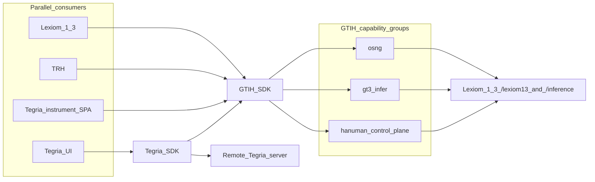

# GTIH API — human overview (`gtih/0.1`)

Short map of the HTTP garden the **GTIH SDK** wraps. Lexiom offers this SDK; vertical UIs consume it.

**Substrate:** today’s Lexiom 1.3 GT3 routes. **No new backend** for v0.1.

**Parallel tracks:** GTIH SDK + Lexiom migration, Tegria instrument SPA / Tegria SDK (with remote domain–tenant data), and TRH integration proceed **in parallel**—not a deferred “Tegria later” phase. They share GTIH; they do not wait on each other.

| Consumer | How it uses GTIH |
|----------|------------------|
| Lexiom 1.3 | Migrates cockpit transport onto GTIH SDK |
| Tegria instrument SPA | Calls GTIH **directly** (transport proof), built **in parallel** with Lexiom migration |
| Tegria UI / Tegria SDK | **Parallel** vertical track: wrapper over GTIH **plus** domain-related and/or **tenant-bounded** data saved and served from a **remote Tegria server**, for the user/player’s benefit. That enrichment **increments the economic value** of the unified SDK for Tegria’s domain consumers |
| The Reasoning Hub (TRH) | Calls **GTIH SDK directly** (no Tegria tenant plane), also **in parallel** |

Normative machine contract: [`openapi.yaml`](./openapi.yaml). Rationale: [`OPENAPI_PROPOSITION.md`](./OPENAPI_PROPOSITION.md).

---

## Integration — single SDK asset (cross-origin clean cut)

Vertical UIs (Tegria, TRH off-host) obtain **one** pre-execution asset: `gtih-sdk.js` from the **GTIH host**.

1. Load `<script src="https://<gtih-host>/gt2/gtih/gtih-sdk.js">` (Tegria: env `GTIH_SDK_URL`, or `DEPLOY_TARGET` — see `../tegria-front-end/src/deployTarget.ts`).
2. Default `window.gtih` **autodiscovers** `baseUrl` from that script’s origin (override via `createGtihClient({ baseUrl })`).
3. All `/lexiom13/*`, `/inference`, and CA module URLs resolve against that base — **not** the UI origin.
4. UI hosts must set **COOP/COEP** for WebContainer labor; GTIH serves the SDK + `/gt2/Lexiom_1_3/ca/*` with **`Cross-Origin-Resource-Policy: cross-origin`**.

**Environment configuration:** set `DEPLOY_TARGET` (`dev` \| `prod`) as an env var on both Tegria and GTIH (shell, `.env`, or Docker `-e`). Default `dev` = localhost. `prod` = Render hosts (`gtih-image-latest` / `tgfe-image-latest`) + CORS allowlist. Tegria's `GTIH_SDK_URL` and GTIH's `CORS_ORIGINS` override those defaults for any other hosts.

Consumers must **not** encode GTIH ports or path maps in app config beyond the SDK script URL.

---

## Diagram (for review)

```mermaid
flowchart LR
  subgraph consumers [Parallel_consumers]
    Lexiom["Lexiom_1_3"]
    TRH["TRH"]
    TegriaSPA["Tegria_instrument_SPA"]
    TegriaUI["Tegria_UI"]
  end
  TegriaSdk["Tegria_SDK"]
  TegriaSrv["Remote_Tegria_server"]
  GTIH["GTIH_SDK"]
  subgraph caps [GTIH_capability_groups]
    OSNG["osng"]
    GT3["gt3_infer"]
    Hanuman["hanuman_control_plane"]
  end
  HTTP["Lexiom_1_3_/lexiom13_and_/inference"]
  Lexiom --> GTIH
  TRH --> GTIH
  TegriaSPA --> GTIH
  TegriaUI --> TegriaSdk
  TegriaSdk --> GTIH
  TegriaSdk --> TegriaSrv
  GTIH --> OSNG
  GTIH --> GT3
  GTIH --> Hanuman
  OSNG --> HTTP
  GT3 --> HTTP
  Hanuman --> HTTP
```

Three GTIH capability groups (detail below): **OSNG**, **GT3 inference**, **Hanuman** (realization control plane).

---

## How to read this

| You are… | You call… |
|----------|-----------|
| Lexiom / TRH / Tegria instrument SPA | `window.gtih.*` (GTIH SDK) — not raw `fetch` paths |
| Tegria UI | `tegria.*` wrapper (GTIH + Tegria remote domain/tenant store) **or** `gtih.*` alone when vertical data is not needed |
| GTIH SDK | the HTTP paths below, unchanged |
| Tegria SDK | GTIH operations **and** Tegria-server APIs (tenant/domain) — out of scope for this GTIH doc; developed **in parallel** |

---

## 1. OSNG — the garden of intention

| Intent | GTIH SDK | HTTP |
|--------|----------|------|
| List live OSN files | `gtih.osng.list()` | `GET /lexiom13/osn/list` → `{ paths: string[] }` |
| Load one node | `gtih.osng.getYaml(path)` | `GET` public path → YAML text |
| Propose OSNG from SUD intent (start) | `gtih.osng.proposeFromIntent({ intent, max_descendants? })` | `POST /lexiom13/osn/propose` → `{ status: "awaiting_browser", run_id, ca_session, meta }` |
| Propose status | `gtih.osng.getProposeStatus(run_id)` | `GET /lexiom13/osn/propose/status/:runId` → `awaiting_browser \| running \| ok \| failed` + lean envelope `{ root_osn_id, nodes }` on ok (Job `meta` separate) |
| Propose labor (browser) | `gtih.hanuman.serveProposeSession(ca_session)` | Lexiom CA WebContainer (`OSNG_PROPOSAL.json`) |
| Propose until done | `gtih.osng.proposeFromIntentUntilDone(...)` | start → labor → poll |
| Propose then realize (TRH) | `gtih.osng.proposeThenRealizeUntilDone(..., { onEnvelope? })` | propose → ephemeral prepare → realize → evidence + SUD; `onEnvelope` fires when the draft OSNG is ready (before prepare/realize) |
| Prism expansion (start) | `gtih.hanuman.startOsnExpand({ path_nodes, prism })` | `POST /lexiom13/osn/propose` with `mode: "expand"`; `path_nodes` = root → selected parent |
| Prism expansion until done | `gtih.hanuman.expandOsnUntilDone(...)` | start → `serveProposeSession` → poll → `{ children, parent_osn_id }` |
| TRH modal LP/RP chat (start) | `gtih.hanuman.startModalChat({ contract, question, osng_envelope, focus_osn_id?, focus_sample?, focus_content?, evidence_summary?, thread? })` | `POST /lexiom13/osn/propose` with `mode: "modal_chat"` + `contract: "lineage_readonly" \| "edit_osng"`; `focus_osn_id` (edit only) names the revision's main target |
| TRH modal LP/RP until done | `gtih.hanuman.modalChatUntilDone(...)` | start → `serveProposeSession` → poll → `{ reply, envelope, contract }` |
| Canonize (create) | `gtih.osng.create({ osn, parentOsnId })` | `POST /lexiom13/osn/save` `operation: "create"` |
| Persist edits | `gtih.osng.update({ osn, previousFileName? })` | same, `operation: "update"` |
| Prune branch | `gtih.osng.delete({ rootOsnId, confirmRootPrune? })` | same, `operation: "prune"` |

**Day-zero propose:** `max_descendants: 0` means a **single-OSN OSNG** (root only). Higher caps are accepted but clamped; multi-node trees grow through prism expansion instead. Draft only — no Lexiom YAML write. Normalized envelope is `{ root_osn_id, nodes }` only — no envelope `meta`. SDK verb stays on `osng.*`; labor is **browser Hanuman** (start/status ticket `meta.labor: hanuman_browser_ca`, plus `PROPOSE_BRIEF.json`), not product `/inference`.

**One evidence per OSN:** proposed nodes (root propose, prism expansion, RP edit) carry exactly **one direct** success evidence. Prompts ask for one, and the host keeps only the first direct evidence (re-id'd `ev.direct.textual_snippet.1`) if the agent writes more.

**Host-minted ids:** newly proposed nodes get fresh `{uuid}.osn` ids from the host (model-written ids are not trusted to be unique). An `edit_osng` revision keeps the ids of nodes already in `PRIOR_OSNG.json` and mints ids only for new nodes.

**Prism expansion:** `mode: "expand"` reuses the propose CA plugin. Hanuman receives only `PATH_OSNG.json` (root → selected parent) and `PRISM.md` (the direction Ram wants the parent expanded in), and writes exactly **1** new child to `OSNG_PROPOSAL.json` (`EXPAND_CHILD_COUNT`). The child refines (narrows or deepens) the parent along the prism, independent of any existing siblings. The host rejects any other count, forces `graph.parent_osn_ids = [parent]`, remints the id, and returns `children` (one-element array) + `parent_osn_id`. Grafting the children onto the envelope is the client's job (TRH appends them and links the parent's `child_osn_ids`; re-expanding a node adds siblings).

**Whole-tree realize:** an ephemeral envelope whose root lists children prepares with `compilation_scope: "self_and_approved_descendants"` and `composition: "merged_refinements"`. The realizer folds every node's `output_spec` into one unified SUD (deeper nodes more specific, no section per branch) and plans evidences for every node in the tree. Single-node envelopes keep `self_only`.

**TRH modal LP / RP (same Hanuman plane):** `mode: "modal_chat"` reuses the propose CA plugin and WebContainer loop. Workspace seeds `PRIOR_OSNG.json`, `FOCUS_SAMPLE.json`, `FOCUS_CONTENT.md` (the focused sample's actual text, from `focus_content`), `EVIDENCE_INDEX.json`, and `OSNG_PROPOSAL.json` (host copy of the prior). `AGENT_PROMPT.md` is identical in structure for both panels; only the **contract** block differs (`lineage_readonly` vs `edit_osng`). LP writes only `CHAT_REPLY.md`; RP writes `CHAT_REPLY.md` and may overwrite `OSNG_PROPOSAL.json` with a revised draft. The gate is reply-first: a missing `CHAT_REPLY.md` fails the run, but an invalid proposal never discards the reply — LP's staged proposal is dropped, RP's becomes `proposal_warning` with `envelope: null`. `write_file` rejects non-JSON content for `*.json` paths so the agent can retry. Status on ok includes `reply` + `envelope` + `contract` + `proposal_warning`. TRH **Apply** to `lastOsngEnvelope` is RP-only — never from LP.

**Twin boundaries:** (1) mandatory mid-method chain — seed → exactly 3 thematic lenses → fold into `output_spec` (scratch: `SEED.md` / `THEMATIC_LENSES.json` under `builds/lexiom13-propose/<runId>/`); (2) finished `OSNG_PROPOSAL.json` nodes are allowlist-only (`schema_version`, `id`, `file_name`, `owner`, structural `graph`, `output_spec`, `success_evidences` — **no `title`**) — host silently drops extras. Hanuman draft `id` / `file_name` are opaque `{uuid}.osn`; canon Lexiom garden path-shaped ids are unchanged. Ephemeral prepare may inject `compilation` defaults via `ensureEphemeralCompilation` (control-plane only, not Hanuman’s allowlist). **Realize LM labor** consumes only `output_spec`, `success_evidences`, and structural `graph` (outline/cluster labels use OSN `id`).

**Errors:** On start/status/labor/parse failure the API returns `{ detail, debug }` (no silent deterministic draft). SDK errors expose `err.detail`, `err.debug`, and `err.body`.

**Relationships** and **content** live inside the OSN object on create/update — no separate relationship URL.

Errors usually look like `{ "detail": "…" }` with 4xx/5xx.

---

## 2. GT3 — direct inference

| Intent | GTIH SDK | HTTP |
|--------|----------|------|
| Infer | `gtih.gt3.infer(narrative, { inferenceType? })` | `POST /inference` `{ narrative }` → `{ response }` |
| API key (optional) | `getApiKey` / `setApiKey` | `X-GT3-OpenRouter-Key` (+ OpenAI twin on inference) |

Product inference — not the Hanuman agent broker (`/v1/agent/...`).

---

## 3. Hanuman — realization control plane

Browser CA labor is driven by the host via `serveRealizeSession` / `serveProposeSession` (same WebContainer module). Optional `onLaborEvent(evt)` receives structured CA-only telemetry (`source: 'ca'`, kinds `tool` | `consult` | `fs` | `lifecycle`) during the leap — tool names/paths, consult latency, FS writes, lifecycle stages — not host `phase:` lines and not LM prose. TRH and other GTIH consumers own the labor loop; Lexiom cabinet UX is unchanged.

| Intent | GTIH SDK | HTTP |
|--------|----------|------|
| Prepare worktree (canon YAML) | `gtih.hanuman.prepare({ compilation_root_osn_id, strategy_id? })` | `POST /lexiom13/build/prepare` |
| Prepare from proposed OSNG (ephemeral) | `gtih.hanuman.prepareFromOsngEnvelope({ osng_envelope \| proposal_run_id })` | same prepare; body `osng_envelope` or `proposal_run_id` — **no Lexiom YAML write** |
| Start realization | `gtih.hanuman.realize({ run_id, … })` | `POST /lexiom13/build/run` |
| Browser labor | `serveRealizeSession` / `serveProposeSession(ca_session, { onLog?, onLaborEvent? })` | WebContainer CA |
| TRH modal LP/RP | `startModalChat` / `modalChatUntilDone` | Same propose CA; reply-first (`CHAT_REPLY.md` required, RP proposal optional); contract in `AGENT_PROMPT` only |
| Prism expansion | `startOsnExpand` / `expandOsnUntilDone` | Same propose CA; 1 refining child for the selected node |
| Progress / results | `getStatus` / `watchStatus` | `GET /lexiom13/build/status/{runId}` (poll) |
| Realize until done | `realizeUntilDone({ osng_envelope \| compilation_root_osn_id \| handoff }, { onLaborEvent? })` | prepare → run → labor → poll |
| Evidence for a Focus OSN | `listEvidenceCollections(osnId, runId?)` | `GET /lexiom13/evidence/collections?osn_id=&run_id=` — `run_id` restricts to one build (TRH passes the just-realized run) |
| Evidence for a whole realized tree | `listRunEvidence(envelope, runId)` | one `listEvidenceCollections(id, runId)` per envelope node (root first), merged; each target tagged with `osn_id` — used by the TRH chain and ▶ re-realize |
| Evidence / bud bytes | `getBudArtifactUrl` / `getBudPreviewUrl` / `fetchBudText` / evidence helpers | artifact / preview GETs under `/lexiom13/…` |
| Propose → realize (TRH) | `gtih.osng.proposeThenRealizeUntilDone(..., { onEnvelope? })` | proposeUntilDone → **`onEnvelope`** → ephemeral prepare → realizeUntilDone → evidence + SUD |

**Ephemeral prepare:** draft OSNG from propose can realize without seating nodes on Ram’s White throne (no canon YAML). Handoff `source: "ephemeral_osng_envelope"`. Bud YAML persist is **skipped**; clients still get SUD via `/lexiom13/build/{runId}/artifact/…` or `/preview/…` and evidences via collections.

Without a Hanuman worker, `realize` may stay `running` until timeout. `/build/run` needs a broker key (env or header).

---

## Auth (v0.1)

- Most `/lexiom13/*`: no login cookies. Cross-origin UIs call via GTIH SDK `baseUrl` (CORS on GT3).
- Inference / run: optional OpenRouter key via GTIH SDK (`X-GT3-OpenRouter-Key`).
- Not Lexiom 1.4 Bearer tokens.

---

## What this API is not

- Lexiom cabinet UX, classic Lexiom (`/lexiom/*`), Lexiom 1.4 (`/lexiom14/v1/*`), Ops (`/ops/*`)
- The **Tegria SDK** itself — parallel wrapper *above* GTIH that may add domain/tenant data from a remote Tegria server; specified with Tegria’s vertical, not here
- A claim that OpenAPI generates UI

---

## Version

`gtih/0.1` — living Lexiom 1.3 URLs. Façade path only if the garden grows.
