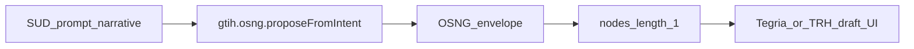

# Shared council proposal — one GTIH call: narrative → proposed OSNG

**Status:** Joint draft from three POVs (Tegria frontend, TRH frontend, GTIH/Lexiom)  
**Date:** 2026-09-12  
**Scope lock:** Exactly **one** SDK API call. Naive **single-OSN** OSNG for day-zero. Full multi-node OSNG arithmetic generation is **out of scope** (named future evolution only).

**Inputs read:** [Tegria_day-zero_OSNG_plan.md](../../Tegria_frontend/Tegria_day-zero_OSNG_plan.md), [API.md](./API.md), Lexiom Hanuman legend (`ca/README.md`).

**Council agents:** [Tegria POV](fcd520cd-3a85-45ba-8238-5959d6efaf6b) · [TRH POV](6f71ebec-1c96-48a1-a2c7-e951ed824511) · [GTIH/Lexiom POV](f772a7a7-1045-436a-9ac9-b9783d8d01ac)

---

## 1. Consensus in one sentence

All three planes agree: expose a single GTIH method that exchanges a SUD-describing **prompt/narrative** for a **proposed OSNG envelope**, implemented first as a **naive one-node garden**, without touching Hanuman realize or Lexiom canon.

---

## 2. What each plane needs (and what they conceded)

| Plane | Needs | Concedes |
|-------|--------|----------|
| **Tegria** | Empty day-zero → Ask Anything → one SDK call → OSNG-shaped draft into tree + editable panes; no Lexiom YAML canonize; room for Tegria wrapper + remote tenant save **without** changing this GTIH signature | Multi-node generation in day-zero; Hanuman-labeled propose if council chooses `osng.*` |
| **TRH** | Direct `window.gtih` (no Tegria wrapper); first brick toward fuller prompt→OSNG→realize→evidences→events | Naive single-node first; shared HTTP with Tegria |
| **GTIH/Lexiom** | Ram grows OSNG / Hanuman realizes SUDs; no prepare/realize regression; proposal is draft-only | Sibling propose path + day-zero UX on a single root node |

**Divergence closed:** Tegria’s day-zero plan placed propose under `gtih.hanuman.proposeOsngFromIntent` with multi-node broker drafting. Council **relocates** the verb to the **OSNG** capability group and **defers** multi-node arithmetic.

---

## 3. Shared API (the only call in this proposal)

### SDK

```ts
// Start — returns immediately (async Hanuman labor)
gtih.osng.proposeFromIntent({
  intent: string;
  max_descendants?: number;
}): Promise<{
  status: "awaiting_browser";
  run_id: string;
  session_id: string;
  ca_session: object;
  meta?: { labor: "hanuman_browser_ca"; ... };
}>;

gtih.osng.getProposeStatus(run_id): Promise<{
  status: "awaiting_browser" | "running" | "ok" | "failed";
  envelope?: { root_osn_id: string; nodes: OsnDraft[]; meta?: object };
  detail?: string;
  debug?: object;
}>;

gtih.hanuman.serveProposeSession(ca_session, { onLog? }): Promise<workerReport>;

// Convenience used by Tegria / TRH
gtih.osng.proposeFromIntentUntilDone(args, { onLog?, onStatus? }): Promise<{
  root_osn_id: string;
  nodes: OsnDraft[];
  meta?: object;
}>;
```

| Field | Agreement |
|-------|-----------|
| **operationId** | `osngProposeFromIntent` |
| **x-gtih-sdk** | `gtih.osng.proposeFromIntent` (start) + `getProposeStatus` + `hanuman.serveProposeSession` |
| **Naming** | Prefer `intent`; `narrative` accepted as synonym |
| **Cap** | `max_descendants` = how many **descendants** the root may have; **0** = single OSN |
| **Labor** | Browser Hanuman (CA plugin `lexiom13.osng_proposer`) writes `OSNG_PROPOSAL.json` — **not** product `/inference` |
| **Not** | Moving the **verb** to `gtih.hanuman.propose*` — Hanuman owns labor; OSNG owns the verb |
| **Not** | Raw `gtih.gt3.infer` alone — that returns prose, not an OSNG envelope |

### HTTP façade (steward preference)

- **Start:** `POST /lexiom13/osn/propose` → `{ status: "awaiting_browser", run_id, ca_session, meta }`.
- **Status:** `GET /lexiom13/osn/propose/status/:runId` → `awaiting_browser | running | ok | failed` + envelope on ok.
- **Session sync:** reuses `/lexiom13/build/session/:id/{workspace,file,artifacts,report}` (propose finalize skips evidence/bud).
- **Primary:** `OSNG_PROPOSAL.json` under `builds/lexiom13-propose/<runId>/`.
- **Errors:** `{ detail, debug }` — **no** silent deterministic draft. Tegria/TRH surface both.

**Known divergence (vs earlier sync council draft):** callers no longer get the envelope on the start Promise; browser must run Hanuman then poll (or use `proposeFromIntentUntilDone`).

### `OsnDraft` (minimal fields for all three UIs)

Enough for Tegria `DocumentView` / TRH structure rail / Lexiom-shaped future:

- `id`, `title`, `seed`, `thematic_lenses`, `output_spec`, `success_evidences`
- `graph.parent_osn_ids`, `graph.child_osn_ids` (empty or self-consistent for single node)
- `schema_version: "osn/0.2"` (or equivalent living Lexiom draft shape)

---

## 4. Naive single-OSN meaning



- The return is still an **OSNG** (a garden proposal), not a bare string.
- v0: `nodes.length === 1`; `root_osn_id` points at that node.
- **Out of scope:** algorithmic multi-node bloom, reciprocal tree synthesis, “OSNG arithmetic.” When that arrives, it fills the **same** `nodes[]` / `graph.*` envelope—callers do not rename the method.

---

## 5. Isolation & non-negotiables (all planes)

| Rule | Why |
|------|-----|
| Do not change prepare / run / BrandLexiom realize UX | Lexiom SUD pipeline stays sacred |
| Do not write proposal into `public/gt2/Lexiom_1_3/*.osn.yaml` | Draft ≠ canon; White Moves remain Ram’s |
| Propose CA ticket is **separate** from realize (plugin `lexiom13.osng_proposer`, no evidence/bud) | Reuses session sync protocol; does not open BrandLexiom build cards |
| No Tegria tenant/domain fields on this call | Tegria wrapper adds remote-server value **in parallel**, without forking GTIH |
| Existing realize `tests/lexiom13-*.test.mjs` stay green | Regression gate |

---

## 6. How each consumer uses the same brick (parallel)

| Consumer | Use |
|----------|-----|
| **Tegria day-zero** | Ask Anything → `proposeFromIntent` → map one root into sidebar + editable sections; local edit loop; Tegria-server save stays on Tegria SDK plane |
| **TRH** | Console prompt → same method → show structure draft; later bind realize / evidences / filtered events to **other** APIs without breaking this one |
| **Lexiom / GTIH** | Own route + SDK + OpenAPI; Known divergence only if UI copy still says “Hanuman propose”; document that naive single-node precedes multi-node evolution |

---

## 7. Explicitly out of scope (this document)

- Multi-node OSNG generation / garden arithmetic  
- Hanuman realize, buds, evidence collections, milestone event streams  
- Canonize / White Move maturation into Lexiom YAML  
- Tegria remote tenant persistence APIs  
- Lexiom 1.4 Bearer / SSE redesign  

---

## 8. Acceptance for “shared brick shipped”

1. `gtih.osng.proposeFromIntent({ intent })` starts an async Job; `proposeFromIntentUntilDone` (or start + `hanuman.serveProposeSession` + `getProposeStatus`) yields the envelope.  
2. On success, status returns `{ root_osn_id, nodes }` with `nodes.length === 1` (day-zero).  
3. Tegria Ask Anything and TRH console can each complete one Hanuman round-trip.  
4. Lexiom prepare/realize tests unchanged in behavior.  

---

## 9. Note to Tegria day-zero plan authors

The council **honors** empty garden + one frontend call + draft review UX from [Tegria_day-zero_OSNG_plan.md](../../Tegria_frontend/Tegria_day-zero_OSNG_plan.md), and **amends** two day-zero claims for shared benefit:

1. SDK home: **`gtih.osng.proposeFromIntent`**, not `gtih.hanuman.proposeOsngFromIntent`.  
2. Result richness: **naive single-OSN** first; multi-node broker tree is future evolution of the same envelope—not the shared day-zero contract.
