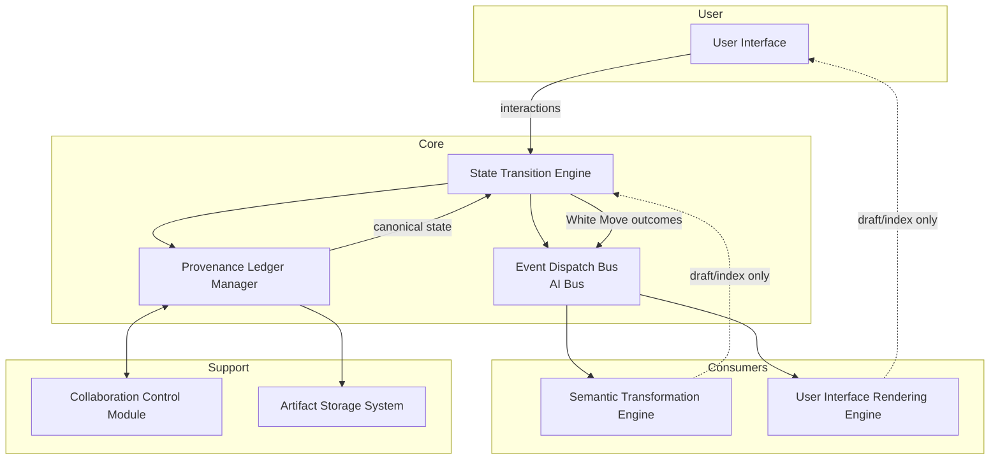
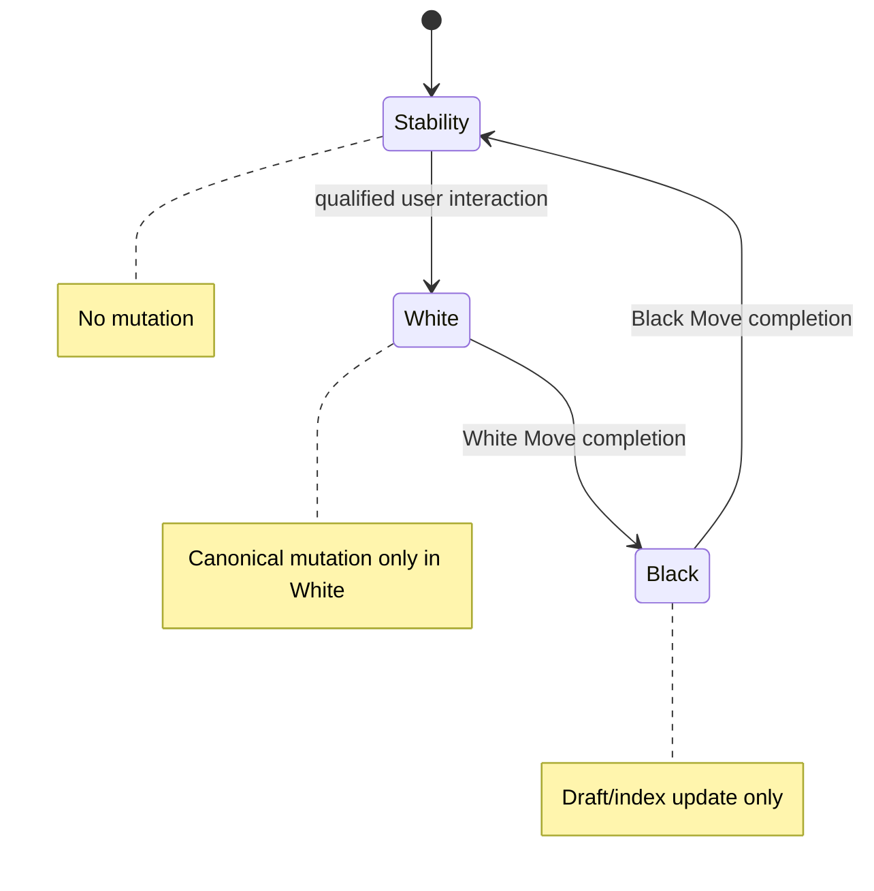
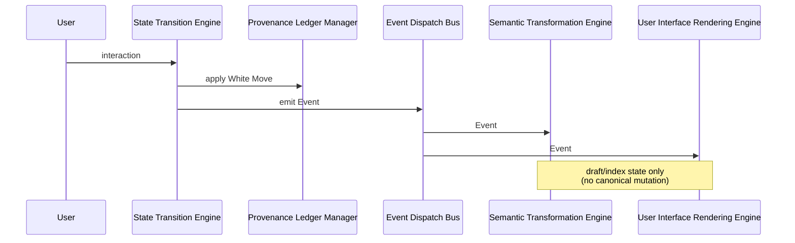
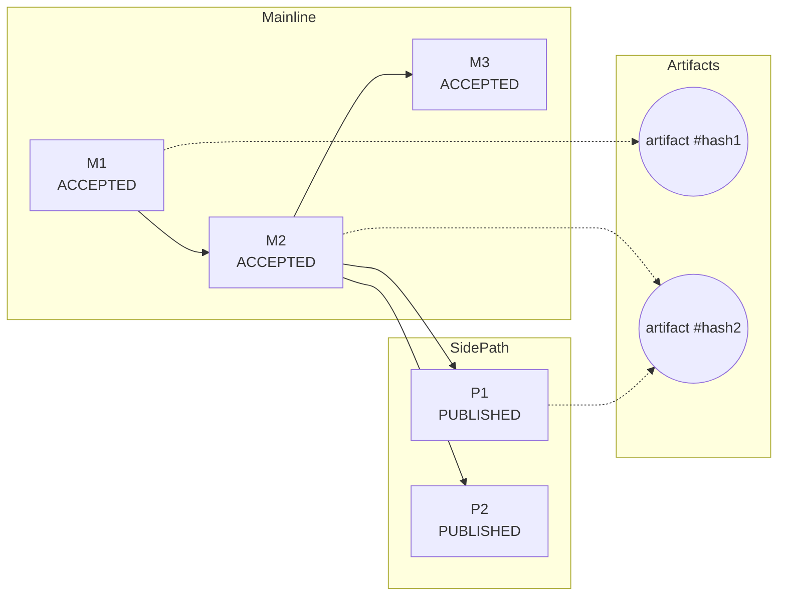
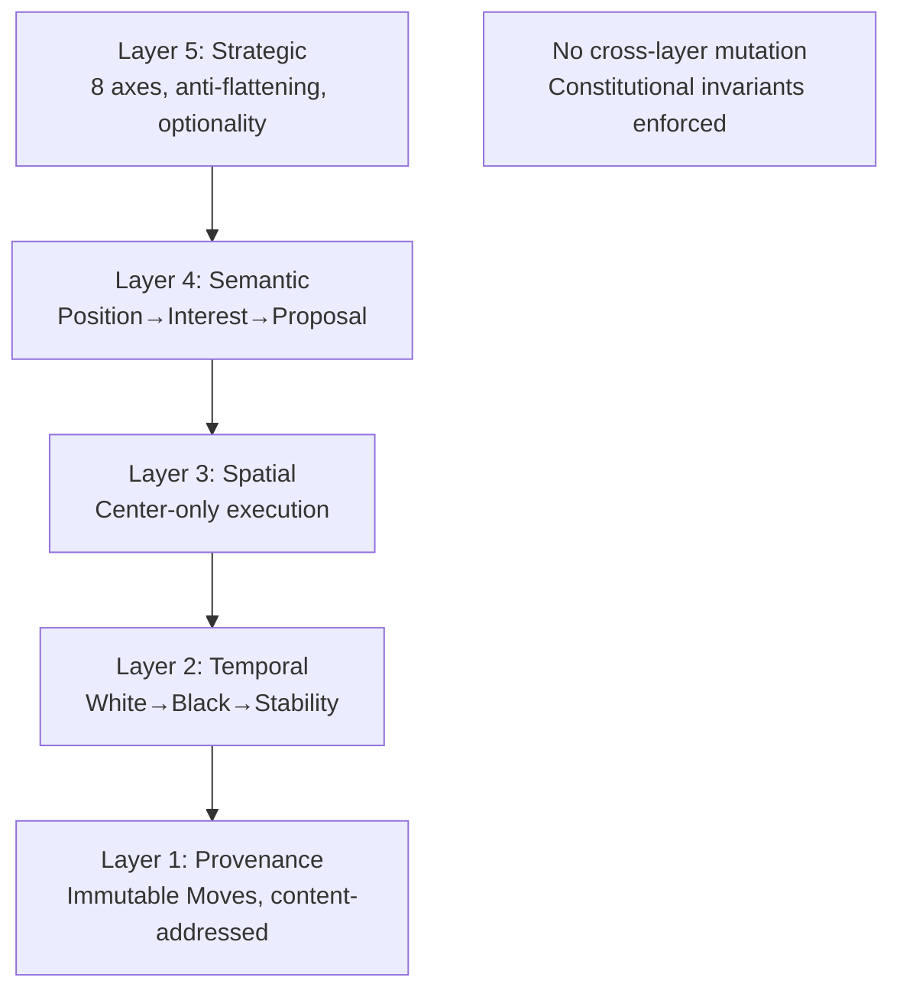
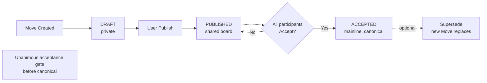
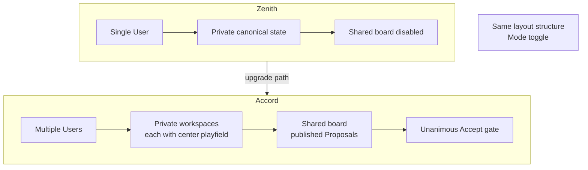

# Lexiom Deterministic Human–AI Collaboration System
## Patent Figures 1–11

**Companion to:** Lexiom_Provisional_Patent_Technical_Disclosure.md  
**Purpose:** Visual representations of architecture, workflows, and data structures for provisional patent filing.  
**Incorporation:** These figures are incorporated by reference in the technical disclosure for earliest-date priority purposes. Figure numbers 1–11 correspond exactly to the narrative descriptions in Section 12 of the disclosure.

---

## Figure 1 — System Architecture Diagram

Block diagram of major system components and data flow.



---

## Figure 2 — White-Black Round State Machine

Three-state temporal model: White → Black → Stability.



---

## Figure 3 — AI Bus Event Flow

Sequence of event dispatch; canonical mutation only from White Move.



---

## Figure 4 — Provenance Spine Data Graph

Directed acyclic graph of Moves; mainline vs. side paths.



---

## Figure 5 — User Interface Layout (Center-Playfield-Only Execution)

```
┌─────────────────────────────────────────────────────────────────────────────────┐
│  Top HUD (fixed height): L1 Case Identity  |  L2 Topic Lenses                    │
├───────────────┬──────────────────────────────────────────┬───────────────────────┤
│               │                                          │                       │
│  Left 20%     │           Center 60%                     │  Right 20%            │
│  Stage Tower  │     [ SOLE EXECUTION SURFACE ]           │  Shared Collab State  │
│  Proposed     │     All editing & approval occur here    │  Private Artifacts    │
│  Actions      │         ↑ entity bindings ↑              │                       │
│  (index only) │                                          │  (index only)         │
│               │                                          │                       │
├───────────────┴──────────────────────────────────────────┴───────────────────────┤
│  Bottom Ribbon: L3 Quick Statements (3)                                           │
└─────────────────────────────────────────────────────────────────────────────────┘

Legend: Index only—no inline editing in panels  |  All editing and approval in Center
```

---

## Figure 6 — Semantic Transformation Pipeline

```mermaid
flowchart LR
    A[User Input<br/>Position] --> B[Parse]
    B --> C[Extract Interest]
    C --> D[Generate Constructive<br/>Proposal (draft)]
    D --> E[Store in draft space]
    E --> F{White Move<br/>approved?}
    F -->|Yes| G[Create Move<br/>Append to provenance]
    F -->|No| E

    style D fill:#ffe0e0
    style E fill:#ffe0e0
    style G fill:#e0ffe0
```

*Draft stages (red tint): Not canonical. Canonical promotion (green): Requires White Move.*

---

## Figure 7 — Five-Layer Orthogonal Architecture



---

## Figure 8 — Draft-Publish-Accept Workflow



---

## Figure 9 — L2 Topic Lenses and L3 Semantic Acceleration

```mermaid
flowchart TB
    subgraph TopHUD
        L2[L2 Selector: Clarification | Impact | Resolution | Options]
    end

    subgraph Center
        CP[Center Playfield<br/>current semantic mode]
    end

    subgraph BottomRibbon
        L3A["L3: Reframe toward shared impact"]
        L3B["L3: Clarify underlying expectations"]
        L3C["L3: Suggest symmetrical formulation"]
    end

    L2 --> CP
    L3A --> WM[L3 click = White Move]
    L3B --> WM
    L3C --> WM
    WM --> RB[Restricted Black<br/>Center + L3 only]
    RB --> CP
```

*L3 click = explicit White Move; restricted scope prevents cascade.*

---

## Figure 10 — Eight-Fold Strategic Matrix Axes

```mermaid
flowchart TB
    P[Proposal]

    subgraph Axes
        A1[(1) Position Self]
        A2[(2) Interests Self]
        A3[(3) Position Other]
        A4[(4) Interests Other]
        A5[(5) Leverage Self]
        A6[(6) Leverage Other]
        A7[(7) Risk Surface]
        A8[(8) Strategic Pathways]
    end

    P --> A1
    P --> A2
    P --> A3
    P --> A4
    P --> A5
    P --> A6
    P --> A7
    P --> A8
```

*Multi-axis completion bias; anti-flattening; optionality preservation.*

---

## Figure 11 — Zenith vs. Accord Mode Architecture



---

*End of Figures — Lexiom Provisional Patent*
